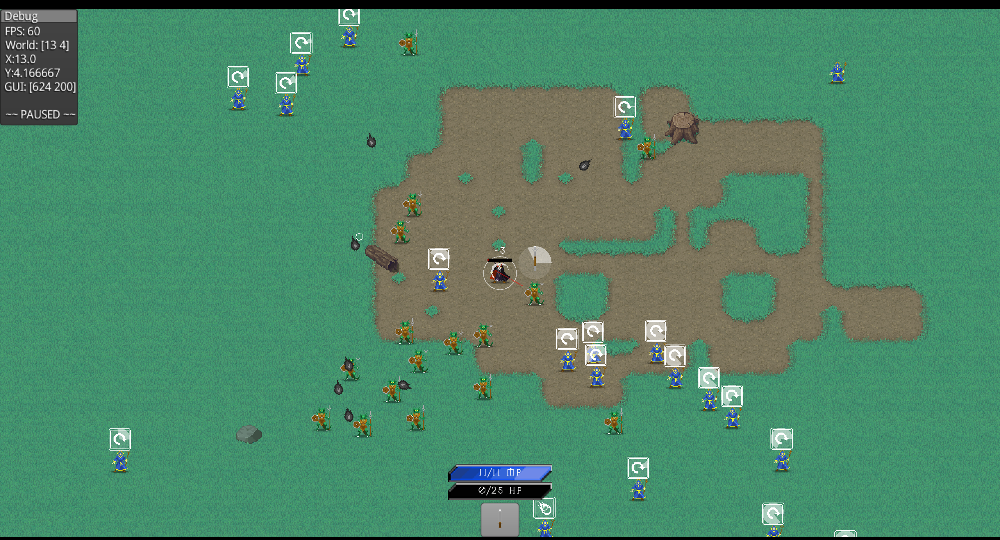

# Cyber Dungeon Quest



**Game Design Document Summary:**

# UnpredictaRPG: Bloodmoon Chronicles

## Concept:
A swift, intense journey through the supernatural realm with impactful decisions and unpredictable events. Drawing inspiration from the darkness of vampire lore, akin to the uncertainty of Diablo 2 but condensed into 20-30 minute cryptic sessions. Embracing circular development, where players navigate a world that challenges and mystifies, refusing conventional character progression.

## Gameplay:
- Quick, strategic decisions in a dark fantasy setting.
- Random events add an air of eerie unpredictability.
- Echoes of Diablo 2 in shorter, cryptic play sessions.
- Circular development ensures the haunting unknown.
- Build your vampiric legacy through diverse "deck" options.

## Future Plans:
Anticipate the unfolding of a strategic night, envisioning a fusion of Warcraft 3's tactics with the mystique of Magic or Warhammer. Initially, the solitary journey into the shadows—a challenging single-player experience—before delving into the complexities of nocturnal networked adventures.

*Awaken the Bloodmoon, where the undead dance in the shadows.*

# Note!

Work in Progress. At the moment only possible to walk around with WASD and get killed.
Skills dont work yet, have to think about controls and which skills to implement.

Press ESC to close menus and walk around a bit.

# How to start

```
lein dev
```

# On Mac

You need to set this environment variable for the lwjgl3 backend to work on mac:

```
export JVM_OPTS=-XstartOnFirstThread
```

# Reloaded Workflow

https://github.com/damn/gdl#reloaded-workflow

# Asset license

The assets used are all proprietary and not open source and can not be re-used!

* Tilesets by https://winlu.itch.io/
* Creatures, Items, Skill-Icons,FX and other assets by https://www.oryxdesignlab.com
* Cursors from Leonid Deburger https://deburger.itch.io/
